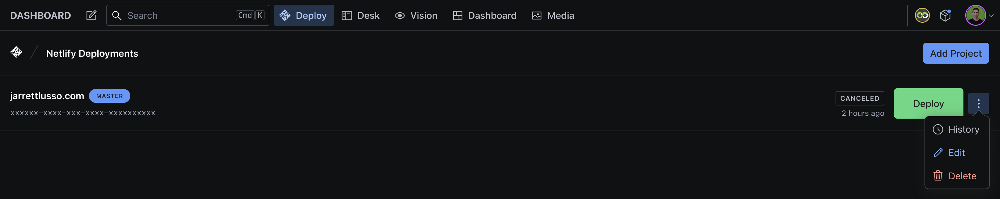

<h3 align="center">
  Netlify Deployment for Sanity
</h3>
<p align="center">
  <strong>Trigger Netlify Deploy Hooks from your Sanity V3 Studio.</strong><br />
✨ LIVE status updates ✨ multiple deployments ✨ active polling ✨
</p>



<br />

## 🔌 Install

```sh
yarn add sanity-plugin-netlify
# or npm
npm i sanity-plugin-netlify
```

> **Warning** <br />This is a **Sanity Studio V3** plugin. There is no V2 version.

<br />

## ⚙️ Configure

```ts
// `sanity.config.ts` / `sanity.config.js`:
import { defineConfig } from 'sanity'
import { netlifyTool } from 'sanity-plugin-netlify'

export default defineConfig({
  // ...
  plugins: [
    // ...
    netlifyTool(),
  ],
})
```

<br />

## 🚀 Your first Netlify Deployment

Once installed, you should see a new "Deploy" tool in your Sanity Studio navbar.

To create a new deployment, click the **"Add Project"** button. Next, you'll be prompted to add the following:

#### `Site Name`

A name for your deployment to help you organize your deployments. <br />
_Typically, this should be the name of the site you're deploying_

#### `Site ID`

This is the Site ID for your site in your Netlify account. <br />
_You can find this in your Netlify site, under Site Settings → General → Site details → "Site ID"_

#### `Build Hook`

This is the Build Hook for your site in your Netlify account. <br />
_You can find this in your Netlify site, under Site Settings → Build & deploy → Build hooks_

#### `Branch` _(optional)_

This will override the default branch for your Build Hook. <br />

#### `Access Token`

This is your Netlify Personal Access Token. <br />
_You can find this in your Netlify account under User dropdown → User settings → Applications → Personal access tokens_

<br />

## 🧪 Develop & test

This plugin uses [@sanity/plugin-kit](https://github.com/sanity-io/plugin-kit)
with default configuration for build & watch scripts.

See [Testing a plugin in Sanity Studio](https://github.com/sanity-io/plugin-kit#testing-a-plugin-in-sanity-studio)
on how to run this plugin with hotreload in the studio.

<br />

## 🤝 License

### MIT

> [jarrettlusso.com](https://jarrettlusso.com) &nbsp;&middot;&nbsp;
> Github [@jclusso](https://github.com/jclusso) &nbsp;&middot;&nbsp;
